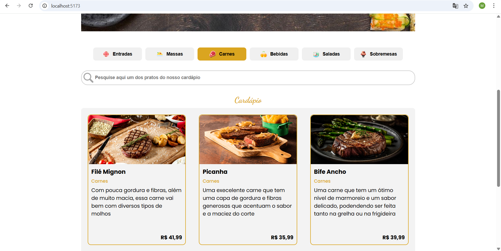
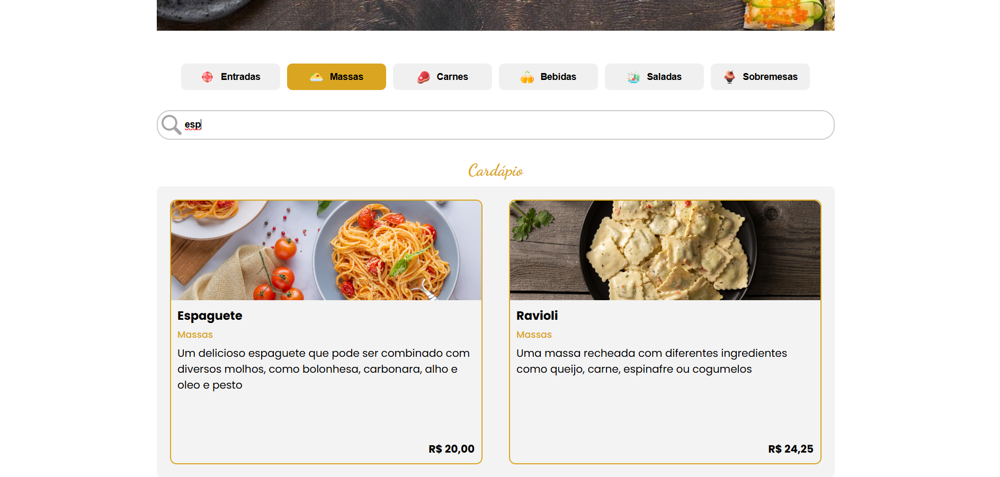
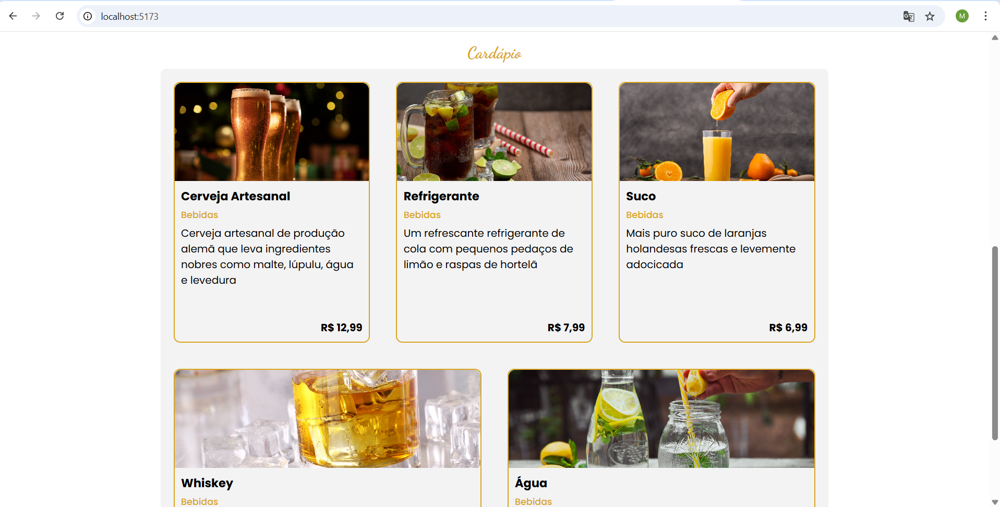

# Digital Menu

A digital menu built with **React + Vite**, **JavaScript**, **Sass**, and **CSS Modules**.  
The application displays a list of products and allows filtering by **category** or by **search input**.

---

## Features

- Product list with image, name, description, category, and price.
- Category filter with active state.
- Search field that filters from **3 characters**.
- Search matches both **product name** and **description**.
- Combined filtering (category + search).
- Responsive layout.
- Styling with **Sass** and **CSS Modules**.

---

## Tech Stack

| Technology | Purpose |
|-----------|---------|
| **React + Vite** | App setup and UI |
| **JavaScript** | Logic and state management |
| **Sass** | Styling with variables and mixins |
| **CSS Modules** | Scoped component styles |

---

## Filtering Logic

### Category Filter
- Displays only products from the selected category.
- Active category is visually highlighted.

### Search Filter
- Activated when the input has **3 or more characters**.
- Searches through:
  - product **name**
  - product **description**
- Works together with category filter.

---

## Running the Project

### 1. Install dependencies
```sh
npm install
```
### 2. Start development server

```sh
npm run dev
```
### 3. Build for production

```sh
npm run build
```

## Screenshots




